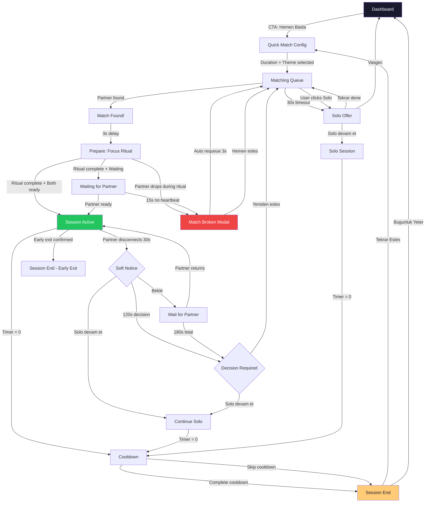

# SESSIZ ORTAK - MVP 1.5 FINAL TECHNICAL DOCUMENT

**Version:** 1.0.0
**Date:** 2026-02-07
**Status:** PRODUCTION-READY SPECIFICATION

---

## TABLE OF CONTENTS

1. [System Audit](#1-system-audit)
2. [Match & Rejoin System](#2-match--rejoin-system)
3. [Session Flow](#3-session-flow)
4. [Focus Ritual & Mindful Cooldown](#4-focus-ritual--mindful-cooldown)
5. [Quest System](#5-quest-system)
6. [Analytics & AI Data Pipeline](#6-analytics--ai-data-pipeline)
7. [System Health & Migration Fix](#7-system-health--migration-fix)
8. [Testing](#8-testing)
9. [Final User Flow](#9-final-user-flow)

---

## 1. SYSTEM AUDIT

### 1.1 Migration Inventory

| File | Status | Issues |
|------|--------|--------|
| 001_initial_schema.sql | Applied | `sessions.duration` CHECK missing 90. `sessions.status` CHECK missing 'preparing'. |
| 002_fix_rls_recursion.sql | Applied | OK |
| 002_queue_cleanup_triggers.sql | Applied | DUPLICATE 002 number |
| 003_fix_session_participants_rls.sql | Applied | OK |
| 004_trust_system_enhancements.sql | Applied | `users.metadata` column never created. `complete_solo_session` references it implicitly. |
| 005_session_completion_triggers.sql | Applied | `trigger_session_completion` causes double trust (dropped in 006) |
| 006_consolidate_functions.sql | Applied | OK — drops trigger, fixes complete_session |
| 006_mvp15_abuse_prevention.sql | CONFLICT | Duplicate 006 number. Drops+recreates `update_trust_score` (conflicts with 006_consolidate). |
| 007_quest_system.sql | NOT APPLIED | References `users.metadata` (column doesn't exist). References `users.streak` (should be `current_streak`). |
| 008_match_lifecycle.sql | NOT APPLIED | Creates `matches` table + match RPCs. Uses `match_state` enum. OK structurally. |
| 009_integrate_matches.sql | NOT APPLIED | `sessions.status = 'preparing'` violates CHECK. `session_participants.status = 'joined'` violates CHECK. |

### 1.2 Critical Schema Gaps

1. **`users.metadata` JSONB column** — Referenced by quest system (007) and cooldown page, NEVER CREATED
2. **`session_participants.metadata` JSONB column** — Referenced by prepare page (ritual data) and cooldown page, NEVER CREATED
3. **`sessions.status` CHECK** — Missing 'preparing' (needed by 009_integrate_matches)
4. **`session_participants.status` CHECK** — Missing 'joined' (used by 009)
5. **`sessions.duration` CHECK** — Only allows (15, 25, 50) but PomodoroSelect offers 90
6. **`matching_queue.priority` CHECK** — Only allows (0, 1, 2) but requeue_after_break uses 3

### 1.3 Frontend-Backend Mismatches

| Frontend | Expected Backend | Actual |
|----------|-----------------|--------|
| prepare/page.tsx | `matches` table + RPCs | Table exists in 008 (not applied) |
| prepare/page.tsx | `session_participants.metadata` | Column doesn't exist |
| cooldown/page.tsx | `session_participants.metadata` | Column doesn't exist |
| QuestComponents.tsx | Quest RPCs | Functions exist in 007 (not applied) |
| active/page.tsx → redirect to `/session/cooldown` | Session flow: active → cooldown → end | Working (if 006 applied) |

---

## 2. MATCH & REJOIN SYSTEM

### 2.1 Match Lifecycle State Machine

```
preparing ──┬── active ────── completed
            │
            └── broken ──┬── requeued (partner gets high-priority queue slot)
                         └── solo_continued (session continues solo)
```

### 2.2 States

| State | Description | Entry Condition |
|-------|-------------|-----------------|
| `preparing` | Both users complete ritual | `find_match` creates match |
| `active` | Session timer running | Both users mark ready (`mark_match_ready`) |
| `broken` | One user disconnected | Heartbeat detects 15s silence |
| `completed` | Session finished | Timer reaches 0 + `complete_session` RPC |

### 2.3 Heartbeat Rules

```
Every 5 seconds: client → match_heartbeat(match_id)
  └── Updates caller's last_heartbeat timestamp
  └── Checks partner's last_heartbeat
  └── If partner_last_heartbeat > 15s ago → match.state = 'broken'
```

### 2.4 Disconnection Timeline

| Elapsed | System Action | UI Action |
|---------|---------------|-----------|
| 0-15s | Nothing | Nothing (Supabase Presence shows away) |
| 15s | `match.state = 'broken'` | Nothing visible yet |
| 30s | — | Soft UI notice: "Esin baglanti kaybetti. Bekle / Solo devam et" |
| 2min | — | Decision required: "Solo devam et / Yeniden esles" |
| 3min | Auto-requeue via `requeue_after_break` | Redirect to quick-match with `requeue=true` |

### 2.5 Rejoin Logic

```
IF partner returns within 3 minutes:
  AND match.state = 'broken':
    → Allow rejoin (update heartbeat, set match.state back to 'active')
    → Session timer resumes from last known position (sessions.started_at unchanged)

IF match.state = 'completed' OR match.state = 'requeued':
  → Deny rejoin
  → Show: "Seans sona erdi. Yeni seans baslayabilirsin."
```

### 2.6 Solo Mode Entry

```
Available after 30s of partner disconnect.
  → match.state remains 'broken'
  → sessions.mode updated to 'solo'
  → Session timer continues from current position
  → XP multiplier: 0.8x (reduced)
  → Trust change: 0 (neutral — user did nothing wrong)
```

### 2.7 Matches Table (Final Schema)

```sql
CREATE TABLE public.matches (
  id UUID PRIMARY KEY DEFAULT gen_random_uuid(),
  session_id UUID REFERENCES public.sessions(id) ON DELETE CASCADE,
  user_a_id UUID NOT NULL REFERENCES public.users(id),
  user_b_id UUID NOT NULL REFERENCES public.users(id),
  pomodoro_duration INTEGER NOT NULL DEFAULT 25,
  state TEXT NOT NULL DEFAULT 'preparing'
    CHECK (state IN ('preparing', 'active', 'broken', 'completed')),
  broken_reason TEXT DEFAULT NULL,
  user_a_ready BOOLEAN DEFAULT false,
  user_b_ready BOOLEAN DEFAULT false,
  user_a_last_heartbeat TIMESTAMPTZ DEFAULT NOW(),
  user_b_last_heartbeat TIMESTAMPTZ DEFAULT NOW(),
  created_at TIMESTAMPTZ DEFAULT NOW(),
  updated_at TIMESTAMPTZ DEFAULT NOW()
);
```

> Decision: TEXT with CHECK instead of ENUM. Enums can't be altered in Supabase without migration pain. TEXT+CHECK is equally safe and easier to evolve.

### 2.8 SQL Functions

| Function | Purpose | Idempotent |
|----------|---------|------------|
| `match_heartbeat(match_id)` | Update heartbeat, check partner, auto-break | Yes (timestamp overwrite) |
| `mark_match_ready(match_id)` | Mark user ready after ritual, transition to active | Yes (bool set) |
| `break_match(match_id, reason)` | Explicit break (user exit during ritual) | Yes (state check) |
| `complete_match(match_id)` | Mark match completed when session ends | Yes (state check) |
| `requeue_after_break(duration, theme)` | High-priority re-queue after match break | Yes (DELETE+INSERT) |
| `rejoin_match(match_id)` | Partner returns within 3min window | Yes (state check) |

### 2.9 Realtime Channels

```
Channel: match:{matchId}
  └── postgres_changes on matches table (UPDATE, filter: id=eq.{matchId})
  └── Used by useMatchHeartbeat hook

Channel: session:{sessionId}
  └── Supabase Presence (user_id as key)
  └── Track: { user_id, avatar_id, name, status, session_goal, last_heartbeat }

Channel: session-updates:{sessionId}
  └── postgres_changes on sessions (UPDATE) + session_participants (UPDATE)
```

### 2.10 Edge Cases

| Scenario | Handling |
|----------|----------|
| Tab close during ritual | Heartbeat stops → partner sees broken after 15s → MatchBrokenModal |
| Page refresh during active session | Rejoin via URL params (session_id in URL). Load session data, resume timer from started_at. |
| Network loss (temporary) | Heartbeat fails silently. If < 15s, partner doesn't notice. If > 15s, match breaks. On reconnect, heartbeat resumes. |
| Both users disconnect | Both heartbeats expire. Match becomes broken. Neither gets penalty (no one "left"). |
| User has match_broken modal and partner returns | Not implemented yet. For MVP 1.5: once broken, stays broken. |

---

## 3. SESSION FLOW

### 3.1 Complete Flow (Single Duration Selection)

```
/dashboard
  └── CTA: "Hemen Basla"
        ↓
/session/quick-match
  └── Phase: config
      ├── Duration select: 15 / 25 / 50 / 90
      ├── Theme select
      └── Click "Esles"
        ↓
  └── Phase: matching
      ├── Insert into matching_queue
      ├── Call find_match RPC
      ├── If found → Phase: found → redirect
      ├── If not found → listen realtime
      └── After 30s → Phase: solo-offer
        ↓
/session/prepare?id={sessionId}&matchId={matchId}&duration={duration}
  └── FocusRitual (80s, 4 steps, non-skippable)
  └── On complete → mark_match_ready(matchId)
  └── If both ready → redirect to active
  └── If partner breaks → MatchBrokenModal → requeue
        ↓
/session/active?id={sessionId}
  └── Timer runs from sessions.started_at
  └── Heartbeat every 5s (duo) / 15s (solo)
  └── Partner presence via Supabase Channels
  └── On timer=0 → complete_session / complete_solo_session
  └── On partner left → PartnerLeftModal → solo continue / exit
        ↓
/session/cooldown?id={sessionId}
  └── MindfulCooldown (90s, skippable)
  └── Mood + Reflection selection
  └── Data saved to session_participants.metadata
        ↓
/session/end?id={sessionId}
  └── Results: XP, Trust, Streak
  └── Rating (duo only)
  └── Quest results
  └── Actions: "Tekrar Esles" / "Bugunluk Yeter"
```

### 3.2 Duration: Single Source of Truth

```
Duration is selected ONCE in quick-match config phase.
  → Stored in matching_queue.duration
  → Propagated to sessions.duration via find_match
  → Propagated to matches.pomodoro_duration via find_match
  → NEVER asked again after match
```

### 3.3 Ritual Gate

```
Both users MUST complete ritual before session starts.
  → Ritual completion → mark_match_ready(matchId)
  → mark_match_ready checks: both user_a_ready AND user_b_ready
  → If both ready: match.state → 'active', session.status → 'active', session.started_at = NOW()
  → If one user drops during ritual: heartbeat detects → match.state → 'broken'
```

---

## 4. FOCUS RITUAL & MINDFUL COOLDOWN

### 4.1 Focus Ritual

| Step | Name | Duration | Interaction |
|------|------|----------|-------------|
| 1 | Breath Anchor | 20s | Auto-advance |
| 2 | Intent Setting | 30s | Select intent (4 options) or auto-advance with default |
| 3 | Body Check | 15s | Auto-advance |
| 4 | Ready Confirmation | 15s | Click "Basla" or auto-advance |

**Total: 80s, non-skippable.**

**Constraints:**
- App backgrounding (`document.hidden`) pauses timers
- Force-close: ritual marked incomplete in metadata
- Duplicate writes: `mark_match_ready` is idempotent (bool set, no counter)

**Data stored in `session_participants.metadata.ritual`:**
```json
{
  "completed": true,
  "intent": "finish",
  "started_at": "2026-02-07T10:00:00Z",
  "completed_at": "2026-02-07T10:01:20Z"
}
```

### 4.2 Mindful Cooldown

| Step | Name | Duration | Interaction |
|------|------|----------|-------------|
| 1 | Pause | 10s | Auto-advance |
| 2 | Mood Check | — | Select mood (5 options) |
| 3 | Reflection | — | Select reflection (4 options) |
| 4 | Closing | 20s | Click "Tamam" or auto-advance |

**Total: ~90s, skippable with trust penalty.**

**Skip penalty:**
- Trust: -1 (via `update_trust_score`)
- XP: -5 (applied in session end logic)
- Event type: `cooldown_skipped`

**Data stored in `session_participants.metadata.cooldown`:**
```json
{
  "completed": true,
  "skipped": false,
  "mood": "good",
  "reflection": "focused"
}
```

### 4.3 Trust & XP Impact Table

| Action | Trust | XP |
|--------|-------|----|
| Session completed (duo) | +2 | +50 base |
| Session completed (solo) | +2 (or +5 if rehab) | +40 base |
| Goal completed | 0 | +10 |
| 5-star rating received | +5 | 0 |
| 4-star rating received | +2 | 0 |
| 3-star rating | 0 | 0 |
| 2-star rating received | -2 | 0 |
| 1-star rating received | -5 | 0 |
| Cooldown skipped | -1 | -5 |
| Early exit (<20%) | -4 | 0 |
| Early exit (20-60%) | -8 | 0 |
| Early exit (>60%) | -15 | 0 |
| No show | -10 | 0 |
| Ghosting (5min idle) | -20 | 0 |
| Daily quest completed | 0 | +5 |
| Weekly quest completed | +1 | +15 |
| Hidden quest unlocked | +1 | +10 |

---

## 5. QUEST SYSTEM

### 5.1 Daily Quests (3, rotating)

| ID | Title | Description | Target | Condition |
|----|-------|-------------|--------|-----------|
| `daily_ritual_1` | Ritulle Basla | Complete 1 session with ritual | 1 | `metadata.ritual.completed = true` |
| `daily_pomodoro_25` | Derin Odak | Complete 2 sessions of 25+ min | 2 | `session.duration >= 25` |
| `daily_cooldown` | Bilincli Kapanis | Don't skip cooldown | 1 | `metadata.cooldown.skipped = false` |

Rotation: Cycle through `[0, 1, 2]` each day. Day index stored in `users.metadata.quests.daily.day_index`.

### 5.2 Weekly Quests (3, rotating)

| ID | Title | Description | Target | Condition |
|----|-------|-------------|--------|-----------|
| `weekly_streak_3` | 3 Gunluk Seri | 3-day streak | 3 | `users.current_streak >= 3` |
| `weekly_sessions_5` | Haftalik Hedef | 5 sessions this week | 5 | Session count in current week |
| `weekly_duration_mix` | Sure Cesitliligi | Try 2 different durations | 2 | Distinct durations in week |

Rotation: If completed → next quest next week. If not completed → same quest carries over.

### 5.3 Hidden Quests (Full Catalog)

| ID | Title | Condition | One-time |
|----|-------|-----------|----------|
| `hidden_first_ritual` | Ilk Rituel | First ritual completion | Yes |
| `hidden_first_50` | Derin Dalis | First 50-min session | Yes |
| `hidden_first_90` | Maraton | First 90-min session | Yes |
| `hidden_no_skip_day` | Tam Gun | Complete ritual + cooldown in same day | Yes |
| `hidden_late_night` | Gece Kusu | Session after 23:00 | Yes |
| `hidden_comeback` | Geri Dondun | Session after 48h inactivity | Yes |
| `hidden_ritual_streak_3` | Rituel Ustasi | 3 consecutive days with ritual | Yes |
| `hidden_duration_mix` | Cesitlilik | 3 different durations in 7 days | Yes |
| `hidden_streak_save` | Son Dakika | Session at 23:00+ saving a streak | Yes |
| `hidden_3_sessions_day` | Uclu Guc | 3 sessions in one day | Yes |
| `hidden_5_sessions_week` | Hafta Yildizi | 5 sessions in one week | Yes |

### 5.4 Quest Trigger Logic

```
After session completion (complete_session / complete_solo_session):
  1. Frontend calls: process_session_quests(user_id, session_id)
  2. SQL function:
     a. Reads session_participants.metadata (ritual, cooldown data)
     b. Calls update_daily_quest → checks conditions, increments progress
     c. Calls update_weekly_quest → checks conditions, increments progress
     d. Calls check_hidden_quests → checks all unearned hidden quests
     e. Returns: { daily: {...}, weekly: {...}, hidden_unlocked: [...] }
  3. Frontend shows results on session/end page
```

### 5.5 Quest UI Component Structure

```
Dashboard page:
  └── DailyQuestCard (shows today's quest + progress)
  └── WeeklyQuestPanel (shows this week's quest + progress)

Session/End page:
  └── Quest results section (shows completed quests)
  └── HiddenQuestModal (bottom sheet when hidden quest unlocked)

Components:
  └── src/components/quests/QuestComponents.tsx
      ├── DailyQuestCard
      ├── WeeklyQuestPanel
      ├── HiddenQuestModal
      └── QuestProgress (shared progress bar)
```

---

## 6. ANALYTICS & AI DATA PIPELINE

### 6.1 Event Naming Convention

```
{domain}_{action}_{qualifier}

Examples:
  match_found
  match_broken_partner_timeout
  session_completed_duo
  ritual_completed
  cooldown_skipped
```

### 6.2 Analytics Events Table

```sql
CREATE TABLE public.analytics_events (
  id UUID PRIMARY KEY DEFAULT gen_random_uuid(),
  user_id UUID REFERENCES public.users(id) ON DELETE SET NULL,
  session_id UUID REFERENCES public.sessions(id) ON DELETE SET NULL,
  event_name TEXT NOT NULL,
  properties JSONB DEFAULT '{}',
  created_at TIMESTAMPTZ DEFAULT NOW()
);

CREATE INDEX idx_analytics_event_name ON analytics_events(event_name, created_at);
CREATE INDEX idx_analytics_user ON analytics_events(user_id, created_at);
```

### 6.3 Event Catalog

| Event Name | Properties | Trigger |
|------------|------------|---------|
| `match_found` | `{ duration, theme, wait_time_s }` | find_match returns session_id |
| `match_broken_partner_timeout` | `{ match_id, elapsed_s }` | match_heartbeat detects timeout |
| `match_broken_user_exit` | `{ match_id, elapsed_s }` | break_match called |
| `rejoin_success` | `{ match_id, gap_s }` | rejoin_match succeeds |
| `rejoin_denied` | `{ match_id, reason }` | rejoin_match fails |
| `solo_mode_entered` | `{ session_id, reason }` | User clicks "Solo devam et" |
| `ritual_completed` | `{ intent, duration_s }` | FocusRitual onComplete |
| `ritual_incomplete` | `{ step, reason }` | Force-close during ritual |
| `cooldown_completed` | `{ mood, reflection }` | MindfulCooldown onComplete |
| `cooldown_skipped` | `{ step }` | User clicks "Atla" |
| `session_completed` | `{ mode, duration, xp, trust_change }` | complete_session / complete_solo_session |
| `quest_daily_completed` | `{ quest_id, reward_xp }` | update_daily_quest returns completed=true |
| `quest_weekly_completed` | `{ quest_id, reward_xp, reward_trust }` | update_weekly_quest returns completed=true |
| `quest_hidden_unlocked` | `{ quest_id }` | check_hidden_quests returns non-empty |

### 6.4 Analytics Insert Function

```sql
CREATE OR REPLACE FUNCTION public.log_analytics_event(
  p_event_name TEXT,
  p_properties JSONB DEFAULT '{}',
  p_session_id UUID DEFAULT NULL
)
RETURNS VOID
LANGUAGE plpgsql
SECURITY DEFINER
SET search_path = public
AS $$
BEGIN
  INSERT INTO analytics_events (user_id, session_id, event_name, properties)
  VALUES (auth.uid(), p_session_id, p_event_name, p_properties);
END;
$$;
```

### 6.5 AI Data Pipeline (Future — Design Only)

```
Data available for AI consumption:

1. Session patterns:
   - analytics_events WHERE event_name LIKE 'session_%'
   - Join with users for demographic context

2. Focus quality signals:
   - ritual completion rates
   - cooldown skip rates
   - idle/away presence duration during sessions

3. Social matching signals:
   - partner ratings (trust_events)
   - match break frequency
   - rejoin success rates

4. Behavioral predictions:
   - Users likely to churn: decreasing session frequency + increasing cooldown skips
   - Users likely to be problematic: increasing early exits + low ratings received

Data shape: All stored in Postgres, queryable via Supabase service_role.
Export: pg_dump → JSON → feed to model.
No real-time AI in MVP 1.5.
```

---

## 7. SYSTEM HEALTH & MIGRATION FIX

### 7.1 Migration Fix Strategy

One consolidation migration (`010_mvp15_final.sql`) that:

1. Adds missing columns (`users.metadata`, `session_participants.metadata`)
2. Expands CHECK constraints (session status, participant status, duration, priority)
3. Expands trust event types for quests and analytics
4. Creates analytics_events table
5. Adds rejoin_match function (missing from 008)
6. Drops the `match_state` enum (replace with TEXT CHECK, already done by using TEXT in table def)
7. Safe: all operations are IF NOT EXISTS / additive

### 7.2 Verification Queries

```sql
-- 1. Stuck queue records (waiting but expired)
SELECT * FROM matching_queue
WHERE status = 'waiting' AND expires_at < NOW();

-- 2. Orphaned matches (preparing for > 10 minutes)
SELECT * FROM matches
WHERE state = 'preparing' AND created_at < NOW() - INTERVAL '10 minutes';

-- 3. Sessions stuck in 'waiting' (> 5 minutes old)
SELECT * FROM sessions
WHERE status = 'waiting' AND created_at < NOW() - INTERVAL '5 minutes';

-- 4. Session participants without sessions
SELECT sp.* FROM session_participants sp
LEFT JOIN sessions s ON sp.session_id = s.id
WHERE s.id IS NULL;

-- 5. Users with invalid trust levels
SELECT id, trust_score, trust_level FROM users
WHERE (trust_score >= 150 AND trust_level != 'legend')
   OR (trust_score >= 120 AND trust_score < 150 AND trust_level != 'elite')
   OR (trust_score >= 90 AND trust_score < 120 AND trust_level != 'verified')
   OR (trust_score >= 70 AND trust_score < 90 AND trust_level != 'trusted')
   OR (trust_score >= 50 AND trust_score < 70 AND trust_level != 'newbie')
   OR (trust_score < 50 AND trust_level != 'restricted');
```

### 7.3 Cleanup Scripts

```sql
-- Expire stuck queue entries
UPDATE matching_queue SET status = 'expired'
WHERE status = 'waiting' AND expires_at < NOW();

-- Abandon stuck waiting sessions
UPDATE sessions SET status = 'abandoned', ended_at = NOW()
WHERE status = 'waiting' AND created_at < NOW() - INTERVAL '10 minutes';

-- Break orphaned preparing matches
UPDATE matches SET state = 'broken', broken_reason = 'system_cleanup'
WHERE state = 'preparing' AND created_at < NOW() - INTERVAL '10 minutes';

-- Fix mismatched trust levels
UPDATE users SET trust_level = CASE
  WHEN trust_score >= 150 THEN 'legend'
  WHEN trust_score >= 120 THEN 'elite'
  WHEN trust_score >= 90 THEN 'verified'
  WHEN trust_score >= 70 THEN 'trusted'
  WHEN trust_score >= 50 THEN 'newbie'
  ELSE 'restricted'
END
WHERE trust_level != CASE
  WHEN trust_score >= 150 THEN 'legend'
  WHEN trust_score >= 120 THEN 'elite'
  WHEN trust_score >= 90 THEN 'verified'
  WHEN trust_score >= 70 THEN 'trusted'
  WHEN trust_score >= 50 THEN 'newbie'
  ELSE 'restricted'
END;
```

---

## 8. TESTING

### 8.1 Playwright Test Scenarios (Web)

```
test_01_normal_match_flow:
  1. User A opens /session/quick-match, selects 25min, clicks Esles
  2. User B opens /session/quick-match, selects 25min, clicks Esles
  3. Assert: both redirected to /session/prepare
  4. Both complete ritual
  5. Assert: both redirected to /session/active
  6. Wait for timer to end
  7. Assert: both redirected to /session/cooldown
  8. Both complete cooldown
  9. Assert: both on /session/end with XP and trust

test_02_partner_disconnect_1s:
  1. Match found, both in prepare
  2. User B closes tab after 1s
  3. Assert: User A sees MatchBrokenModal after 30s
  4. User A clicks "Yeniden esles"
  5. Assert: User A back in quick-match queue

test_03_partner_disconnect_30s:
  1. Match found, session active
  2. User B closes tab
  3. Wait 30s
  4. Assert: User A sees soft notice "Esin baglanti kaybetti"
  5. User A clicks "Solo devam et"
  6. Assert: session.mode = 'solo', timer continues

test_04_partner_disconnect_120s:
  1. Match found, session active
  2. User B closes tab
  3. Wait 120s
  4. Assert: User A sees decision modal
  5. User A clicks "Yeniden esles"
  6. Assert: requeue_after_break called, priority = 3

test_05_solo_mode_fallback:
  1. User A opens quick-match, selects 15min
  2. No partner found after 30s
  3. User A clicks "Tek basina devam et"
  4. Assert: solo session created
  5. Timer runs, complete_solo_session called
  6. Assert: XP = 40 base

test_06_ritual_completion_gate:
  1. Match found, both in prepare
  2. User A completes ritual, User B doesn't
  3. Assert: User A sees "Esini bekliyoruz..."
  4. User B completes ritual
  5. Assert: mark_match_ready returns both_ready = true
  6. Assert: both redirected to active

test_07_cooldown_skip_penalty:
  1. Session completed, on cooldown screen
  2. User clicks "Atla"
  3. Assert: cooldown.skipped = true in metadata
  4. Assert: trust_change includes -1 for cooldown skip

test_08_queue_recovery_after_crash:
  1. User A is in matching_queue
  2. Simulate tab close
  3. User A returns to /session/quick-match
  4. Assert: old queue entry expired or deleted
  5. User A can start fresh matching
```

### 8.2 Detox Test Scenarios (Mobile — Future Reference)

```
detox_01_normal_match:     Same as Playwright test_01
detox_02_app_background:   App goes to background during ritual → timer pauses
detox_03_force_close:      App force-closed during session → rejoin on reopen
detox_04_network_loss:     Airplane mode for 20s → recover without match break
detox_05_network_loss_60s: Airplane mode for 60s → match broken, solo offered
```

---

## 9. FINAL USER FLOW

### 9.1 Mermaid Diagram



### 9.2 State Transitions (Zero Ambiguity)

```
sessions.status:
  preparing → active      (both users ready via mark_match_ready)
  preparing → abandoned   (match broken, no requeue)
  active → completed      (timer ends, complete_session)
  active → abandoned      (early exit, no one remains)
  waiting → active        (solo mode auto-start)
  waiting → abandoned     (user cancels before start)

matches.state:
  preparing → active      (both ready)
  preparing → broken      (heartbeat timeout during ritual)
  active → broken         (heartbeat timeout during session)
  active → completed      (session completed)
  broken → active         (rejoin within 3min — future)

session_participants.status:
  waiting → active        (session starts)
  joined → active         (session starts, via prepare flow)
  active → completed      (session completed)
  active → left_early     (early exit)
  waiting → no_show       (never joined)
```

---

## APPENDIX A: Migration Execution Order

For a fresh Supabase instance, apply in this order:

```
001_initial_schema.sql
002_fix_rls_recursion.sql
002_queue_cleanup_triggers.sql
003_fix_session_participants_rls.sql
004_trust_system_enhancements.sql
005_session_completion_triggers.sql
006_consolidate_functions.sql
006_mvp15_abuse_prevention.sql
007_quest_system.sql
008_match_lifecycle.sql
009_integrate_matches.sql
010_mvp15_final.sql          ← NEW (fixes all gaps)
```

## APPENDIX B: Environment

```
Supabase URL: https://cuyqemecconaaaggduyn.supabase.co
GitHub: https://github.com/DmcDiyar/body-doubling.git
Branch: main
Stack: Next.js 14 App Router + Supabase + Zustand + Tailwind + Framer Motion
```
